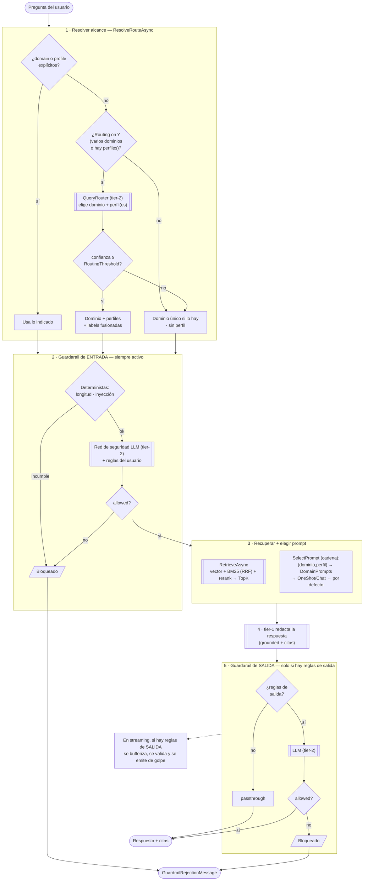
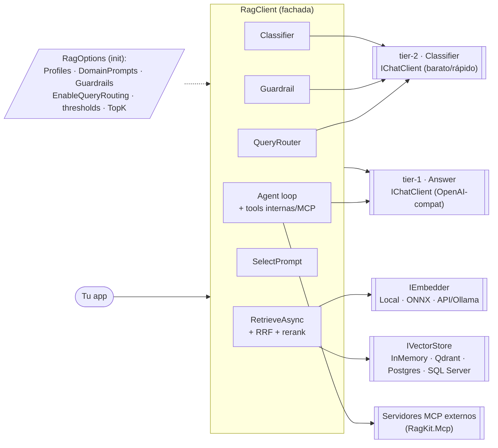

# Arquitectura de RagKit

Diagramas del funcionamiento actual: el **pipeline de consulta** (con enrutado,
perfiles y guardarails), el **pipeline de ingesta** y la **vista de componentes**.

---

## 1) Pipeline de consulta (`AskAsync` / `AskStreamAsync` / `ChatSession`)

Una pregunta atraviesa cuatro decisiones encadenadas con **degradación elegante**:
enrutado → guardarail de entrada → recuperación + prompt → respuesta → guardarail de salida.



**Notas de coste/latencia por consulta:** el enrutado es 1 llamada tier-2 (solo si
procede y solo en el 1er turno de un chat); el guardarail de entrada es **siempre**
1 llamada tier-2 (salvo cortocircuito determinista); la respuesta es 1 llamada tier-1;
el guardarail de salida añade 1 tier-2 solo si defines reglas de salida.

---

## 2) Pipeline de ingesta (`IngestAsync` / `IngestFileAsync`)

```mermaid
flowchart TD
    DOC([Texto o fichero]) --> EXT[Extraer texto<br/>PDF/DOCX/TXT]
    EXT --> D0{¿hay dominios<br/>definidos?}
    D0 -- "no" --> REJ([Rechazado])
    D0 -- "sí" --> D1{¿dominio explícito?}

    D1 -- "no · AutoClassify" --> CLS[["Classifier (tier-2)<br/>dominio + etiquetas + confianza"]]
    CLS --> TH{confianza ≥<br/>ClassificationThreshold?}
    TH -- "no" --> REJ
    TH -- "sí" --> CHUNK

    D1 -- "sí" --> VAL{¿dominio válido?}
    VAL -- "no" --> REJ
    VAL -- "sí" --> CHUNK

    CHUNK[Trocear por frontera<br/>de frase] --> EMB[["Embedder<br/>(Local / ONNX / API·Ollama)"]]
    EMB --> STORE[["IVectorStore<br/>InMemory · Qdrant · Postgres · SQL Server"]]
    STORE --> LEX[Índice léxico BM25<br/>(para búsqueda híbrida)]
    STORE --> OK([Indexado:<br/>dominio, etiquetas, nº chunks])
```

---

## 3) Vista de componentes

La fachada `RagClient` orquesta; lo que cambia rápido (LLM, embeddings, store) vive
tras interfaces. Los **dos tiers** son clientes `IChatClient` compatibles OpenAI.



---

### Leyenda de la cadena de resolución (degradación elegante)

| Decisión | Orden de resolución (cae al siguiente si no hay match) |
|---|---|
| **Dominio** | explícito → enrutado (tier-2) → único dominio → ninguno |
| **Perfil** | explícito → seleccionado (tier-2, multi si `MultiProfile`) → ninguno |
| **Prompt** | `(dominio,perfil)` → `DomainPrompts[dominio]` → `OneShotPrompt`/`ChatPrompt` → por defecto |
| **Guardarail entrada** | deterministas (siempre) → LLM red de seguridad (siempre) + reglas del usuario |
| **Guardarail salida** | reglas de salida del ámbito (solo si existen) → passthrough |
